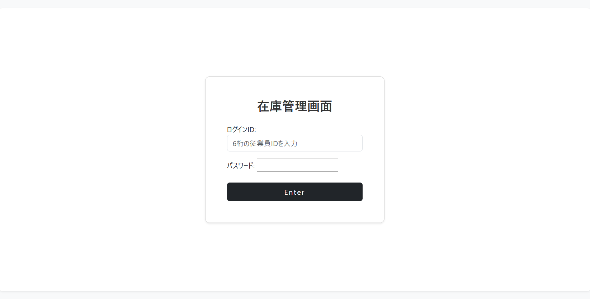
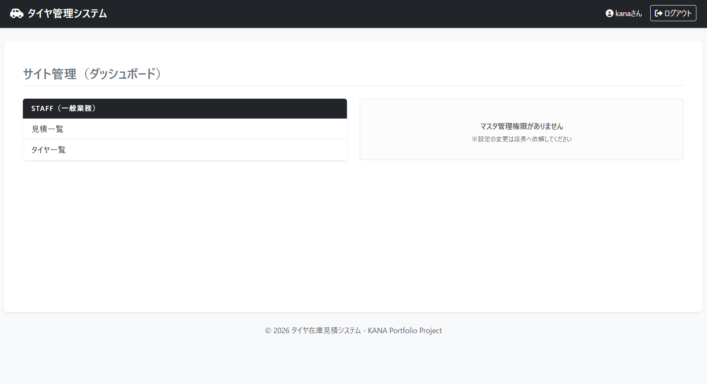
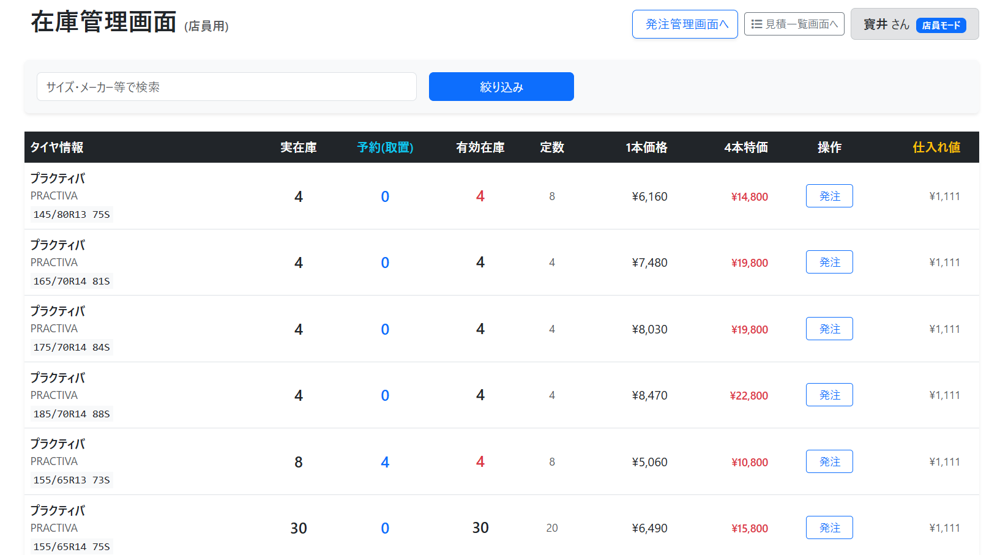
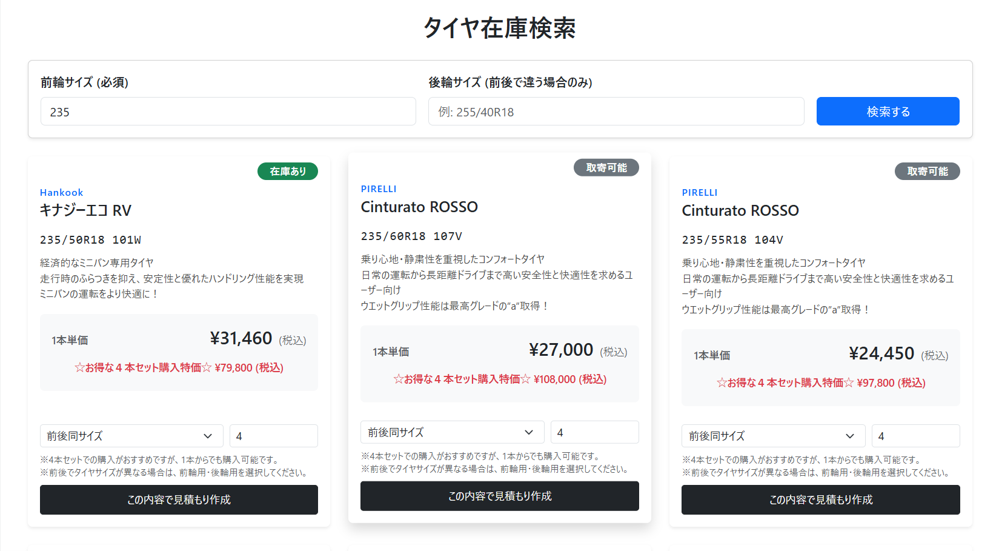
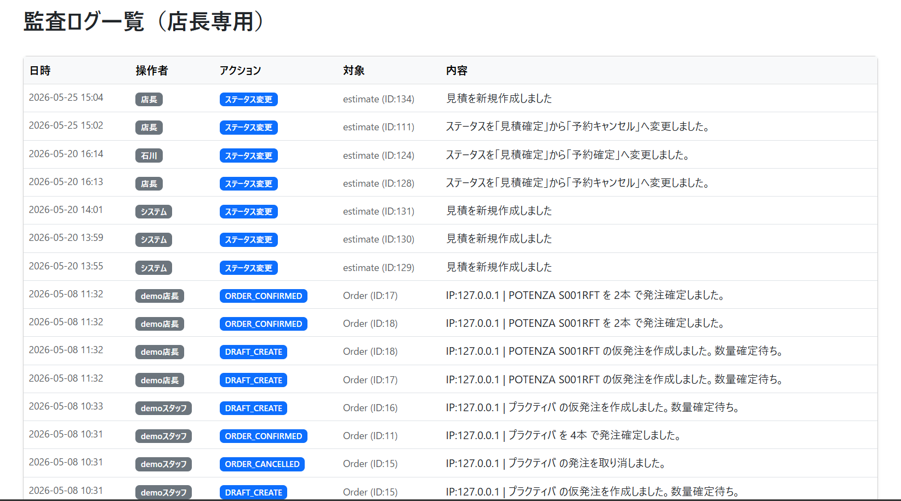

# タイヤ在庫・見積管理システム (Tire Inventory & Estimator)
タイヤ販売店における在庫管理、見積作成、ステータス追跡を一元管理するWebアプリケーションです。
業務で発生しがちな「計算ミス」「在庫見落とし」「属人化」を解消し、効率的かつ正確な店舗運営を支援します。

## 本アプリの特徴
在庫・見積・予約・監査ログを一体化し、「業務ミスを防ぐ設計」を重視した実務志向アプリケーション

## 開発の背景
タイヤ販売の現場では、手書き見積や口頭での情報共有が多く、以下のような課題が発生していました。
- **見積計算ミス:** 特価適用や複雑な工賃（ランフラットタイヤ等）の計算漏れ
- **在庫管理の甘さ:** 在庫不足の見落としによる機会損失
- **属人化と不明瞭な履歴:** トラブル時に「誰が、いつ、どのステータスに変更したか」を追跡できない

これらの課題を解決するため、**「在庫・見積・予約・操作履歴」を統合管理できるシステム**を開発しました。

## 公開URL
https://tire-inventory-estimator.onrender.com
## デモアカウント
※ログインは「ユーザーID」と「パスワード」で行います
### 店長（※一部操作制限あり）
- ユーザーID: 111111
- パスワード: demo1234
### スタッフ
- ユーザーID: 222222
- パスワード: demo1234
※デモ環境のため以下の操作は制限されています。
- 在庫数の変更
- マスタデータの編集・削除
- ステータス変更による在庫反映処理
> ※初回アクセス時はRenderの仕様上、起動に30秒〜1分ほどかかる場合があります。

## 主な機能

### 在庫管理
- タイヤマスタ管理（登録・編集・削除）
- 在庫数のリアルタイム表示および**在庫アラート機能**（設定した発注点を下回ると「要発注」表示）

### 見積・予約機能
- 顧客・車種・タイヤ選択による**自動見積算出**
- 作業工賃（組替・廃タイヤ・ランフラット対応等）の自動計算
- ステータス管理（見積中 / 予約確定 / 引渡完了 / キャンセル）
- 見積書・請求書の印刷用プレビュー画面
- **データ保護:** データの整合性を保つため、確定後の見積は編集不可とする実務的な制限

### 権限・監査機能（システムの強み）
- **権限制御:** Django標準の認証機能により、店長（管理・設定）と店員（見積作成）の権限を分離
- **監査ログ:** 「誰が」「いつ」「どのデータを操作したか」を自動記録。トラブル時の原因追跡を可能に
- **論理削除:** 過去の見積に使用された諸費用データは削除せず「無効化」し、データの不整合を防止
- **復活機能:** 無効化したマスタをワンクリックで再度有効化

## 使用技術
- **Backend:** Python 3.14 / Django 6.0.1 / SQLite3
- **Frontend:** HTML5 / CSS3 (Bootstrap 5) / JavaScript（Ajax / Fetch API）
- **Server:** Gunicorn / WhiteNoise (静的ファイル配信)
- **Infrastructure:** Render
  
※ 本アプリはポートフォリオ用途のため SQLite を採用しています。  

## 技術的な工夫・こだわり
- **データ整合性:** 外部キーに `PROTECT` を設定し、見積履歴のあるタイヤを誤って削除できないよう設計
- **パフォーマンス:** `select_related` の活用により、DBクエリ数を削減（N+1問題の対策）
- **UX設計:** 在庫不足のバッジ表示や、確定後の見積編集ロックなど、現場のミスを物理的に防ぐ設計

## インストール・起動方法
1. リポジトリをクローン
   `git clone https://github.com/DAYAN0707/tire_inventory_estimator.git`
2. 仮想環境の作成と起動
3. `pip install -r requirements.txt`
4. `python manage.py migrate`
5. `python manage.py runserver`

---

## 画面イメージ

### ログイン画面
ユーザーIDとパスワードによる認証機能を実装しています。

### スタッフ用ダッシュボード
見積作成や在庫確認など、日常業務の起点となる画面です。

### タイヤ在庫一覧
サイズやブランドで検索可能な在庫一覧画面です。

### 見積作成画面
タイヤ・工賃・諸費用を組み合わせて見積を自動計算します。

### 監査ログ画面
誰が・いつ・どのデータを操作したかを記録します。

※その他の画面（発注管理・見積ステータス管理・店長ダッシュボード等）は screenshots フォルダに掲載しています。

### 今後の改善課題
- 発注したタイヤの入荷時に在庫と連動する機能の実装
- 顧客通知機能（SMS / メール）
- 売上・需要分析機能

### このアプリで意識したこと
- 現場で実際に使えるUI/UX設計
- データの整合性と安全性の確保
- 操作履歴の可視化（監査ログ）
- 「動く」だけでなく「運用できる」設計